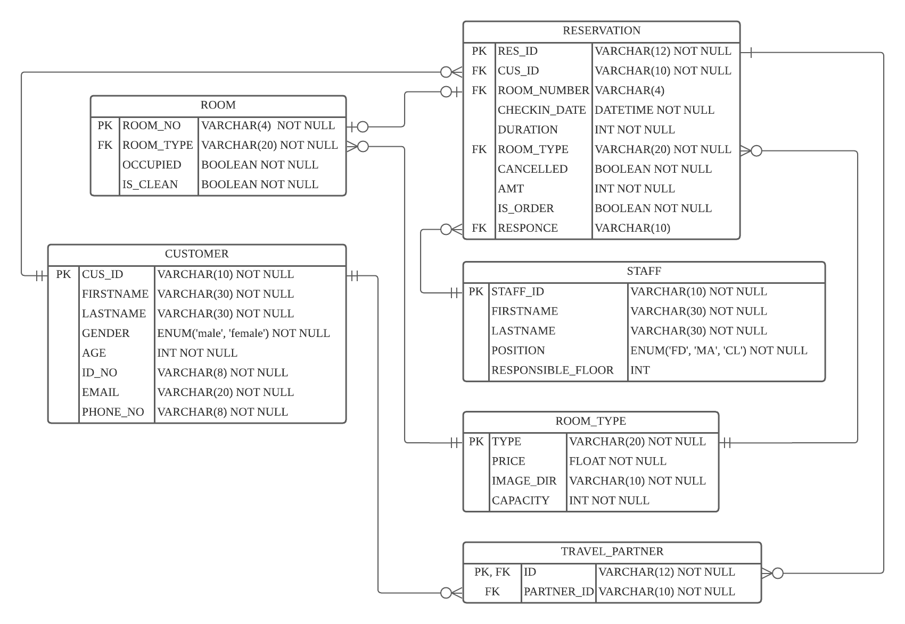
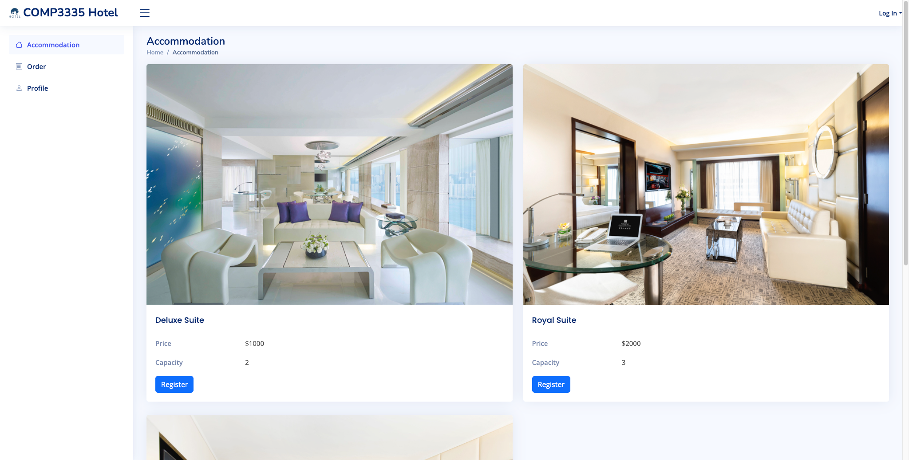

# COMP3335_GROUP21

## Introduction
This is a group project implenmentation of course COMP3335 Database Security at The HK PolyU 2022 Fall By Group21. A hotel information management system demo is developed on the [LAMP Stack](https://en.wikipedia.org/wiki/LAMP_(software_bundle)) under [docker-compose](https://docs.docker.com/compose/). To ensure systematical system, serval techicals including cryptograph, https/SSL connection, access-control, etc. are utilized. 

## Package Dependencies:
- Frontend: [Bootstrap5](https://getbootstrap.com), [JQuery/Ajax](https://jquery.com), [qrcode.js](https://davidshimjs.github.io/qrcodejs/)
- Backend: [php@7.4](https://www.php.net)
- Server: [Apache](https://www.apache.org)/[Ngnix](https://www.nginx.com)
- Database: [mysql@8.*](https://www.mysql.com)
- Data-admin: [phpmyadmin](https://www.phpmyadmin.net)
- Container: [docker](https://www.docker.com)/[docker-compose](https://docs.docker.com/compose/)

## Desgin Diagrams

### Entity-Relationship Diagram

### Privileges on different types of users
| User Type  | Room              | Reservation        | Customer             | Staff         | Room Type | Grant | Create User |
|------------|-------------------|--------------------|----------------------|---------------|-----------|-------|-------------|
| Front Desk | R                 | RU - row&col level | R - row&col level    | R - row level | R         | \     | \           |
| Manager    | CRUD              | RU - row&col level | R - row&col level    | CRUD          | CRUD      | Y     | Y           |
| Cleaner    | R - row&col level | \                  | \                    | R - row level | R         | \     | \           |
| Customer   | \                 | CRU -col&row level | CRUD - row&col level | \             | R         | \     | \           |
| Server     | \                 |                    |                      | \             | R         | Y     | Y           |
| Unregister | \                 | \                  | \                    | \             | R         | \     | \           |

## Key Features
TBD

## Appearance
TBD

## DEMO Video

## How to run?

### Deploy main components:

- Ensure your computer/server have installed [docker](https://www.docker.com) and [docker-compose](https://docs.docker.com/compose/)
- `cd` to the directory `LAMP_STACK`
- Open terminal and run command `docker-compose up --build` to start and run `docker-comopse down` to stop

**OR**

- Run the file `start.sh`

Then,
- Use url https://localhost:8000 or http://localhost:8080 to access the system.
- Use url https://localhost:8081 or http://localhost:8081 to access the phpmyadmin.
- Use host `localhost` and port `33306` to access the database via account `root` and password `test` under the schema `hotel`.

### Deploy Monitor:

* Type `git clone -b main https://github.com/SigNoz/signoz.git && cd signoz/deploy/`
* Type `./install.sh`
* A new container will show in your docker desktop. To access the monitor, To use the monitor, open your browser and enter `localhost:3301` (register required). It will monitor both HTTP requests and database requests.

## Future works

More updates will be address here https://github.com/WPCJATH/COMP3335_GROUP21
