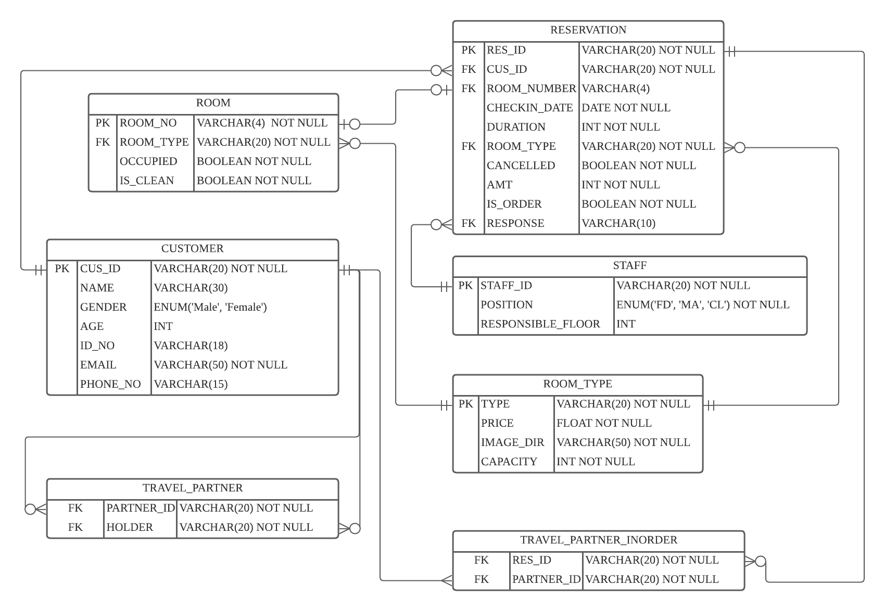

# COMP3335_GROUP21

## Entity-Relationship Diagram

## Privileges on different types of users
| User Type  | Room              | Reservation        | Customer             | Staff         | Room Type | Grant | Create User |
|------------|-------------------|--------------------|----------------------|---------------|-----------|-------|-------------|
| Front Desk | R                 | RU - row&col level | R - row&col level    | R - row level | R         | \     | \           |
| Manager    | CRUD              | RU - row&col level | R - row&col level    | CRUD          | CRUD      | Y     | Y           |
| Cleaner    | R - row&col level | \                  | \                    | R - row level | R         | \     | \           |
| Customer   | \                 | CRU -col&row level | CRUD - row&col level | \             | R         | \     | \           |
| Server     | \                 |                    |                      | \             | R         | Y     | Y           |
| Unregister | \                 | \                  | \                    | \             | R         | \     | \           |

## How to run?

**Deploy main components:**

- Ensure your computer/server have installed [docker](https://www.docker.com) and [docker-compose](https://docs.docker.com/compose/)
- `cd` to the directory `LAMP_STACK`
- Open terminal and run command `docker-compose up --build` to start and run `docker-comopse down` to stop

**OR**

- Run the file `start.sh`

**Deploy Monitor:**

* Type `git clone -b main https://github.com/SigNoz/signoz.git && cd signoz/deploy/`
* Type `./install.sh`
* A new container will show in your docker desktop. To access the monitor, To use the monitor, open your browser and enter `localhost:3301` (register required). It will monitor both HTTP requests and database requests.

